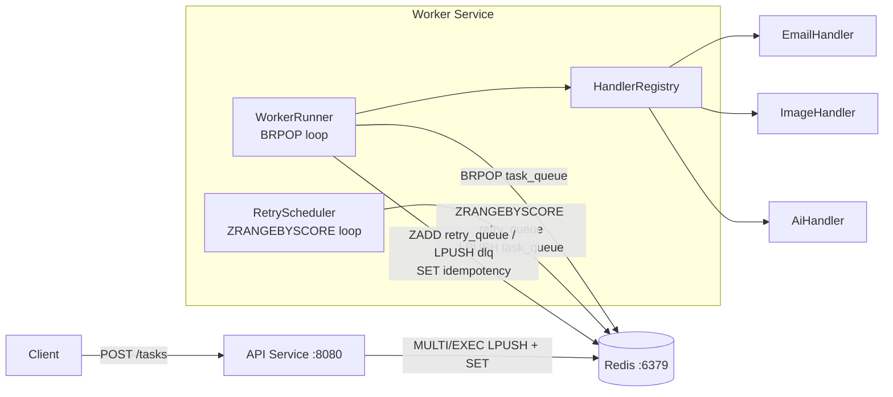
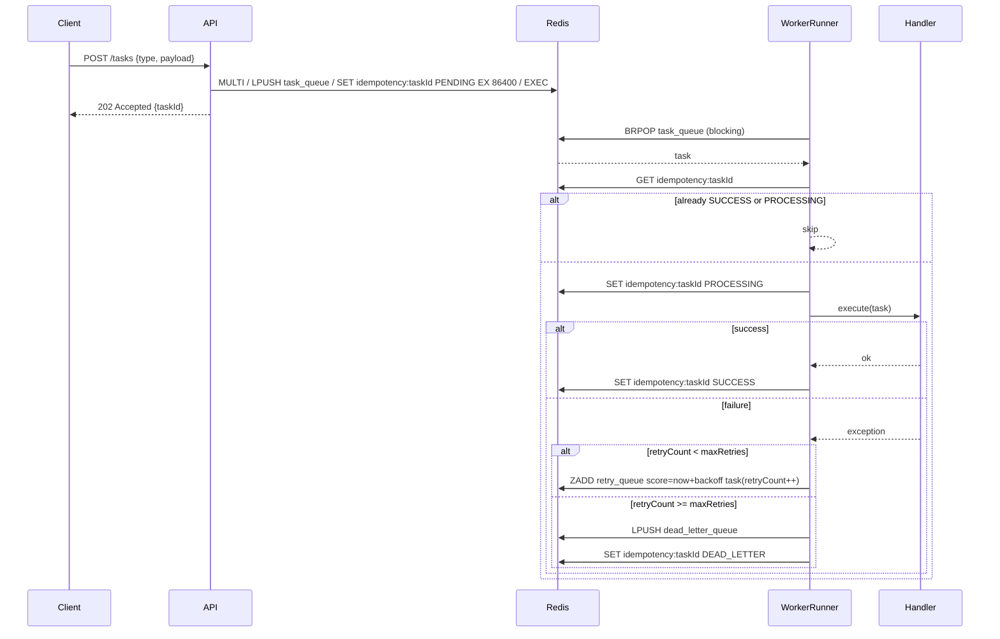
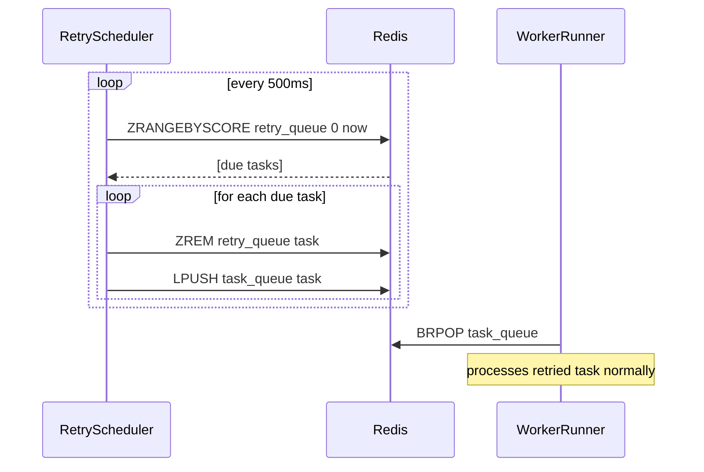

# System Architecture — Distributed Task Queue

---

## 1. Pattern Selection

| Pattern                  | Selected? | Justification                                                                                          |
|--------------------------|-----------|--------------------------------------------------------------------------------------------------------|
| Message Queue            | ✅        | Core mechanism for decoupling API (producer) from Worker (consumer) via Redis List                     |
| Worker Pool              | ✅        | Multi-threaded worker increases throughput; tasks processed concurrently                               |
| Retry with Backoff       | ✅        | Transient failures are retried with exponential backoff before escalating to DLQ                       |
| Dead-Letter Queue        | ✅        | Tasks exceeding maxRetries are moved to DLQ for isolation and manual inspection                        |
| Idempotency              | ✅        | Redis key per taskId prevents duplicate execution across retries and multiple worker instances          |
| Redis Transaction        | ✅        | MULTI/EXEC ensures enqueue + idempotency key write are atomic, preventing partial state on Redis failure |
| Delayed Scheduling       | ✅        | Redis Sorted Set (score = executeAt timestamp) used for retry_queue; scheduler thread promotes due tasks to task_queue without blocking worker threads |
| Outbox Pattern           | ❌        | No database in scope; Redis transaction is sufficient to reduce task loss risk at enqueue              |
| CQRS                     | ❌        | Read/write patterns are simple; no query complexity justifying CQRS                                    |
| Circuit Breaker          | ❌        | Not in scope for v1; handlers are internal, not external service calls                                 |
| Service Discovery        | ❌        | API and Worker are independently deployed but communicate only via Redis, no direct service calls       |
| API Gateway              | ❌        | Single API service; no routing complexity requiring a gateway                                          |

---

## 2. System Components

| Component          | Responsibility                                                                 | Tech Stack         | Port |
|--------------------|--------------------------------------------------------------------------------|--------------------|------|
| **API Service**    | Accept HTTP requests, validate input, enqueue tasks atomically via Redis MULTI/EXEC | Spring Boot 3  | 8080 |
| **Worker Service** | Consume tasks from Redis, dispatch to handler, manage retry and DLQ logic      | Spring Boot 3      | —    |
| **Redis**          | Task queues (main, retry, DLQ), idempotency store                              | Redis 7            | 6379 |

### Worker Service Internal Components

| Component           | Responsibility                                                                 |
|---------------------|--------------------------------------------------------------------------------|
| **WorkerRunner**    | Main loop: BRPOP from `task_queue`, submit tasks to thread pool                |
| **RetryScheduler**  | Scheduler loop: ZRANGEBYSCORE `retry_queue` by current timestamp, promote due tasks to `task_queue` |
| **HandlerRegistry** | Map task type → handler, dispatch execution                                    |
| **EmailHandler**    | Handle EMAIL task type                                                         |
| **ImageHandler**    | Handle IMAGE task type                                                         |
| **AiHandler**       | Handle AI task type                                                            |

---

## 3. Communication

### Component Communication

| From              | To             | Protocol        | Description                                                    |
|-------------------|----------------|-----------------|----------------------------------------------------------------|
| Client            | API Service    | HTTP/REST       | POST /tasks to enqueue a task                                  |
| API Service       | Redis          | Redis protocol  | MULTI/EXEC: LPUSH task_queue + SET idempotency key             |
| WorkerRunner      | Redis          | Redis protocol  | BRPOP from `task_queue` (blocking)                             |
| RetryScheduler    | Redis          | Redis protocol  | ZRANGEBYSCORE `retry_queue` → LPUSH `task_queue` (promotion)   |
| Worker Service    | Redis          | Redis protocol  | SET idempotency key status; LPUSH `dead_letter_queue`          |

### Queue / Data Structure Design

| Key                  | Redis Structure | Producer           | Consumer            | Trigger                                      |
|----------------------|-----------------|--------------------|---------------------|----------------------------------------------|
| `task_queue`         | List            | API Service, RetryScheduler | WorkerRunner | New task or due retry task                   |
| `retry_queue`        | Sorted Set      | Worker Service     | RetryScheduler      | Task failed, retryCount ≤ maxRetries; score = executeAt (Unix ms) |
| `dead_letter_queue`  | List            | Worker Service     | Manual / ops        | Task failed, retryCount > maxRetries         |
| `idempotency:{taskId}` | String (EX 24h) | API Service, Worker Service | Worker Service | Track task execution state                  |

---

## 4. Architecture Diagram

### Component Diagram



### Task Execution Flow



### Retry Scheduling Flow



---

## 5. Deployment

- API Service and Worker Service are **independently deployed** — no shared process or container
- Redis is a shared external dependency accessed by both services
- Each service is containerized with Docker
- Services scale independently:
  - API Service: scale by traffic (horizontal, behind load balancer)
  - Worker Service: scale by queue depth (multiple instances, all BRPOP from same `task_queue`)
  - RetryScheduler: runs inside each Worker instance; Redis ZREM ensures only one instance promotes each task

### Services

| Service          | Image                   | Depends On |
|------------------|-------------------------|------------|
| `api-service`    | `api-service:latest`    | Redis      |
| `worker-service` | `worker-service:latest` | Redis      |
| `redis`          | `redis:7`               | —          |

### Scaling Path

```
# Worker instances compete on BRPOP — Redis guarantees each task consumed by exactly one instance
# RetryScheduler uses ZREM for atomic promotion — no duplicate promotion across instances

docker run worker-service   # instance 1
docker run worker-service   # instance 2
docker run worker-service   # instance N
```
